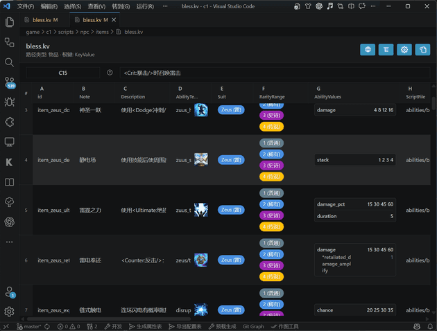
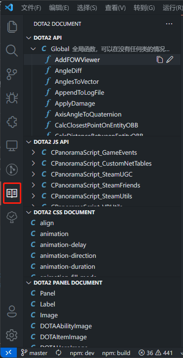
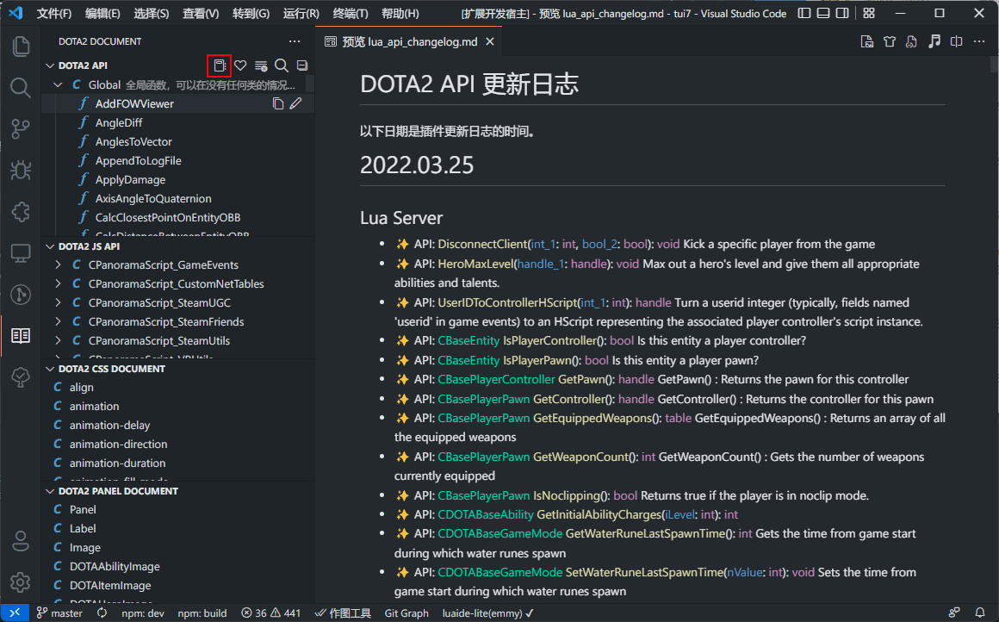
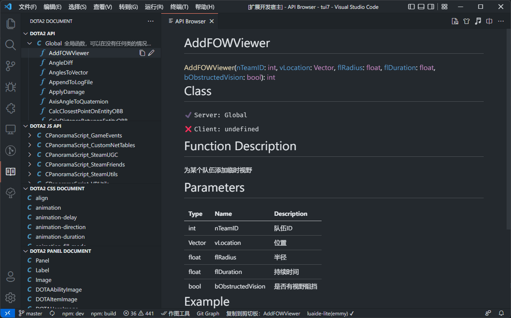
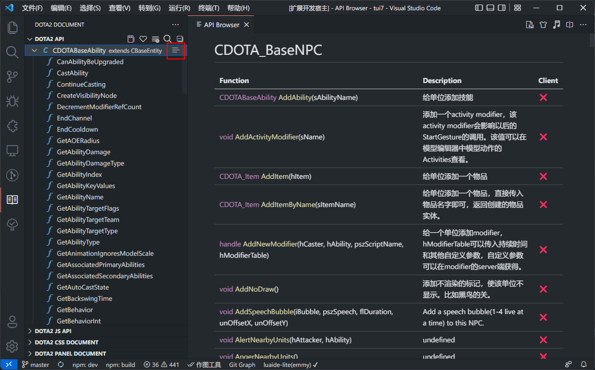
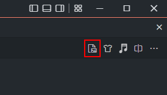
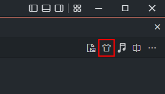
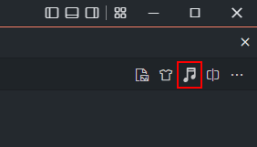

# dota2 作图工具
## 简介

提供一些在制作dota2地图时的便利功能。
## 常见问题

- 如果插件没有生效，检查是否是设置里的excel生成kv配置有问题
- 插件通过检索maps文件夹搜寻game目录与content目录，所以其他文件夹不要命名成maps

## 功能

### KV编辑器


- 支持将 `.kv` / `.txt` 以表格形式打开编辑（命令：`Dota2 Tools: Open KV in KV Editor`）。
- 支持在活动栏 `Dota2 Kv Editor` 中浏览并打开 KV 文件（`Kv Explorer`）。
- 支持按目录类型识别配置：`ability` / `item` / `unit` / `custom`。

#### 使用前配置

1. 在设置中开启模块：`dota2-tools.A1.module_list.dota2kv`。
2. 配置 KV 路径映射：`dota2-tools.A10.kv_editor.paths`。

示例：

```json
"dota2-tools.A10.kv_editor.paths": {
	"${game}/scripts/npc/npc_abilities_custom.txt": "ability",
	"${game}/scripts/npc/npc_items_custom.txt": "item",
	"${game}/scripts/npc/npc_heroes_custom.txt": "unit",
	"${game}/scripts/npc/npc_units_custom.txt": "unit",
	"${game}/scripts/npc/abilities": "ability",
	"${game}/scripts/npc/items": "item",
	"${game}/scripts/npc/units": "unit",
	"${content}/scripts/vscripts/framework/property_system/properties.kv": "custom",
	"${game}/scripts/npc/service": "custom"
},
```

路径支持变量：`${workspace}`、`${game}`、`${content}`。

#### 主要功能

- 行编辑：插入、批量插入、删除、拖拽排序、复制/粘贴行。
- 列编辑：插入、删除、拖拽排序、冻结列、列宽保存。
- 单元格编辑：普通文本、下拉选项、快速填充、公式计算（支持引用如 `A1`、`B2`）。
- AbilityValues 专项编辑：支持结构化编辑与回写。
- 贴图选择器：可为纹理字段快速选择技能/物品图标。
- 本地化联动：支持读取/映射本地化文本，支持保存本地化导出设置。
- 与文本编辑器互跳：可一键切回文本模式编辑。

#### 相关配置文件

- 工作区 KV 编辑器设置：`.vscode/kv_editor_setting.json`
  - 保存列选项覆盖、公式、列公式、列描述、本地化映射等。
- 用户布局设置：`.vscode/kv_editor_user_setting.json`
  - 保存列宽、紧凑模式、本地化显示模式等个人偏好。

#### 公式说明

- 公式语法与示例见：`docs/kv-editor-formula-guide.md`

### DOTA2 文档

- DOTA2 API: lua api查询。支持查看class列表、常量列表与function详情、更新历史、搜寻功能、常用列表、展开折叠、点击复制api。
- DOTA2 JS API: js api查询。支持查看class列表与常量列表、搜寻功能、点击复制api。
- DOTA2 CSS DOCUMENT: css查询。支持查看样式列表、搜寻功能、点击复制样式。
- DOTA2 PANEL DOCUMENT: panel查询。属性查询、event查询。
- lua api支持笔记功能，可写描述与参数的说明以及范例，供自己及他人查看。（修改已有的笔记时请确保自己写的是正确的并且描述不能换行）
- css文档支持笔记功能，可写描述说明以及范例，供自己及他人查看。（修改已有的笔记时请确保自己写的是正确的并且描述不能换行）









### 补全

- lua补全（部分api有注释）、已添加Vector、Qangle、utilsinit.lua、Vlua等。
- css补全
- 支持在设置中关闭补全功能

### 图标查看

- 点击右上角小图标进入图标选择界面
- 支持技能、物品图标查看，包括自定义图标
- 支持英文搜索、英雄图标
- 左键点击复制图标路径
- 右键点击打开图标源文件（不包括自定义的图标）




### 饰品查询

- 支持索引饰品模型路径
- 支持索引信使模型路径
- 支持索引饰品编号




### 音效转换

- 输入音效路径转换可用的事件名




### 本地化拆分

- 监听本地化文件变化并自动合并，在项目game目录下新建localization\schinese文件夹，插件会将里面的文件自动合并至addon_schinese.txt。english同理。
- 可在设置中关闭自动合并功能  

### 划词翻译

- 选取字符右键选择【翻译选择的词条】会调用百度翻译接口进行翻译替换。
- 自动识别首字母中英互换

### KV转JS

- 支持自动将kv文件转成js，方便前端使用
- 需要一个配置文件并在设置中指定该文件
- 可在设置中关闭自动生成

### 跳转功能

- 在技能kv按住<kbd>ctrl</kbd>点击`ScriptFile`跳转到lua脚本，没有脚本文件的时候会自动创建
- 在技能lua右键点击转到技能kv可跳转至kv，多个技能在同一个lua脚本中可在技能名上右键跳转至指定技能kv （某些情况下会失效）
- 如果是ts项目可以打开设置`#dota2-tools.A6.Kv to lua generate typescript#`

### Excel转KV

- 通过配置设置中的监听技能excel路径与输出技能kv路径，可以自动将对应的excel转成kv文件（该类型为多层结构，支持比较复杂的kv）
- 通过配置设置中的监听单位excel路径与输出单位kv路径，可以自动将对应的excel转成kv文件（该类型为单层结构，仅支持一层kv）
- excel路径下需要一个csv文件夹保存对应的csv文件（插件实际是将csv转成kv，主要是因为csv可以合并，支持多人合作）
- 需要配合特定excel使用，该excel打开时会自动读取csv的数据并在保存时会将数据保存至csv，具体可参考[范例](https://github.com/BigCiba/GuardingAthena/tree/master/design/3.kv%E9%85%8D%E7%BD%AE%E8%A1%A8)。

- 每个技能占用两行，第二行预留给AbilitySpecial的值
- AbilitySpecial为特殊处理，多个AbilitySpecial会自动编号
- AbilitySpecial中支持多个键值，在单元格中换行即可
- 支持多层结构，如下图范例所示：使用```Unit1[{]```与```Unit1[}]```将中间列包起来即可，支持嵌套
- 单位excel仅支持单行

### KV转CSV

- 在导出的kv文件上右键可以选择导出成设置中对应的csv
- 配合Excel转KV的功能使用，方便程序直接修改kv
- 该功能也可以用来将别人的KV转成excel，需要提前配置csv